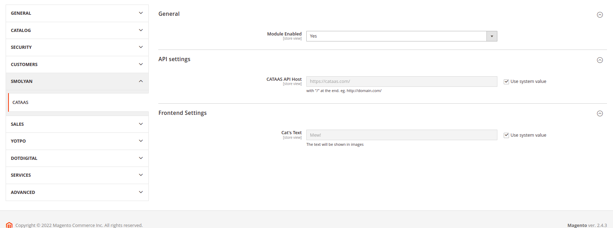
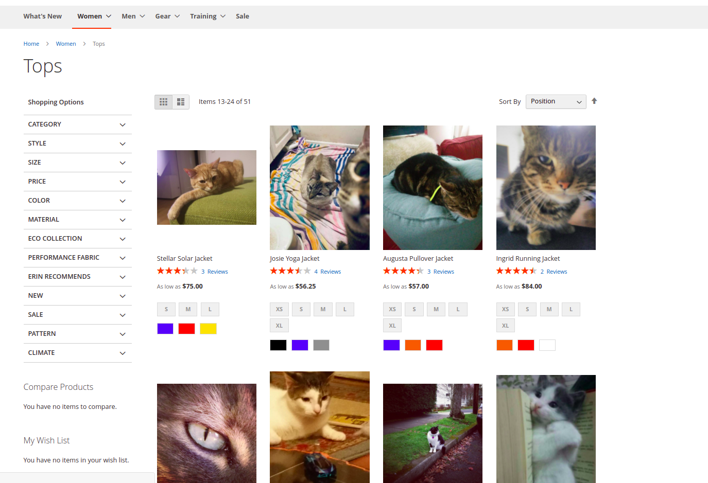
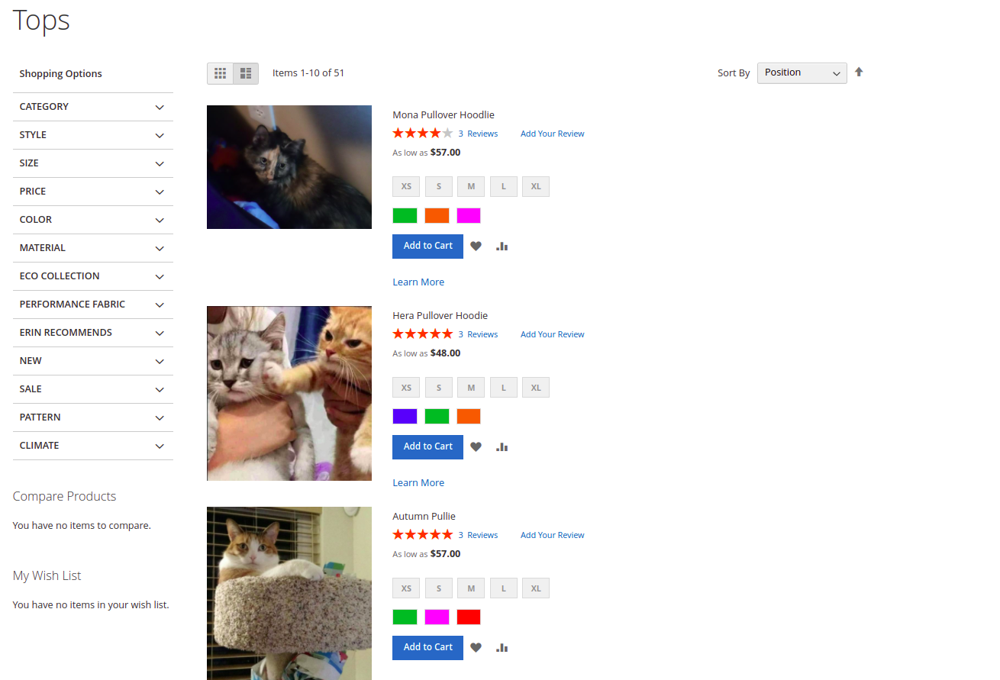
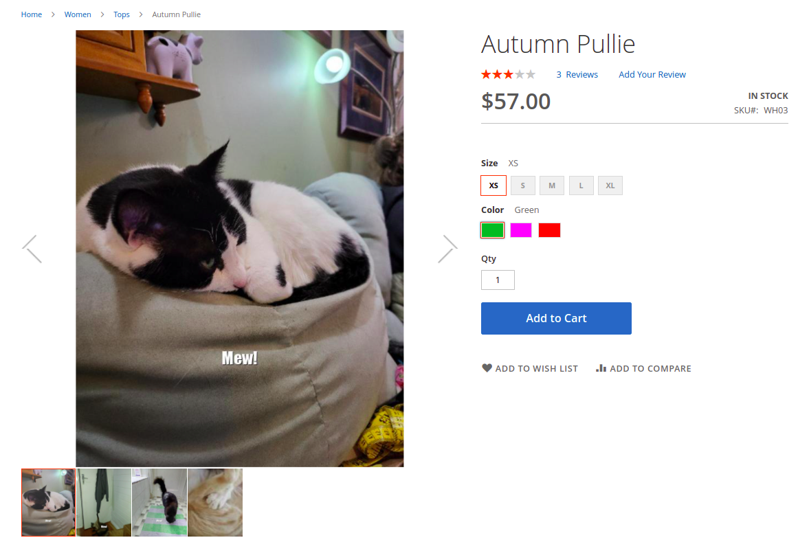
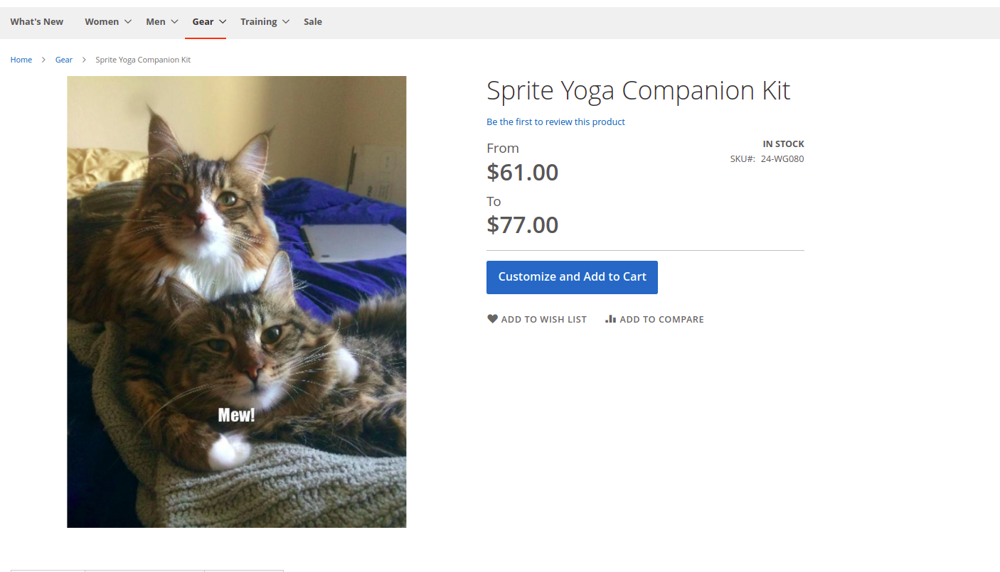

# Magento 2 CATAAS extension
This module was created for demonstrating my code style in case if my code example is needed.
I use this repo instead of test tasks.

Image plugin Magento 2

## Features
- Replace product images with cat images on product details and category list

## Overview

The module has admin settings

Go to admin panel

```
Stores -> Configuration -> BelSmol -> CATAAS
```

There are several tabs



Enabled setting - Enable module if need, by default it's disabled.

API Host setting - host of CATAAS API server

Cat's text setting - text, which will be shown in pictures


###Example of cat images:

Category view page:





Product View Page:

configurable:


related:


virtual:


bundle:


## Requirements
* Magento >= 2.4.3
* Php >= 7.4

## Installation

Create app/code/BelSmol/CATAAS folder and put all module folders to this directory.
Run:

````
php bin/magento module:enable BelSmol_CATAAS
php bin/magento setup:upgrade
php bin/magento setup:di:compile
php bin/magento cache:flush
````
